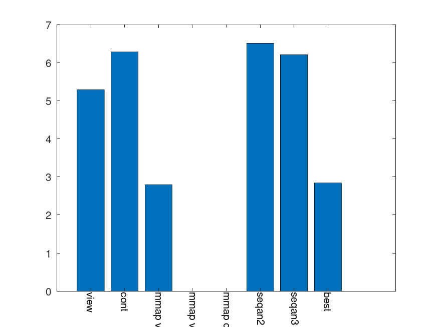
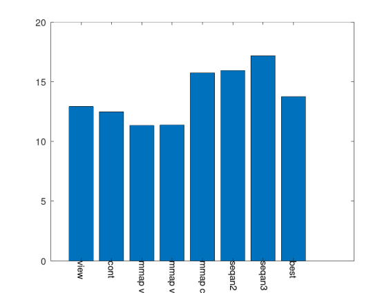
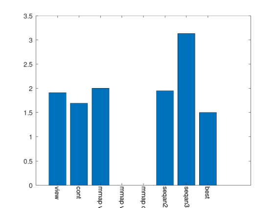
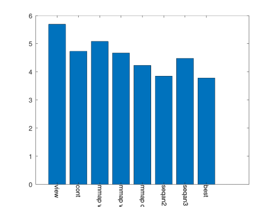

# Small demo for fasta benchmarks

1. compile software by running `./build.sh`
2. run benchmark by running `./bench.sh testdata.fa` or `./bench.sh testdata.fa.gz`
  - timing of zero means nothing was done
  - this call is very file extension sensitive, must be ".fa" or ".gz"
  - you can add `--octave plot.png` to get additional plotting

This should output something like:
```
view 1.170000 4136
cont 1.230000 4140
mmap_view 1.390000 4188
mmap_view2 0.000000 4104
mmap_cont 0.000000 4124
seqan2 1.630000 4124
seqan3 2.780000 4672
best 1.290000 4192
```

The benchmark is running a ACGTN counter:
```
template <typename Reader>
void benchmark(Reader&& reader) {
    std::array<int, 5> ctChars{};
    for (auto && [id, seq] : reader) {
        for (auto c : seq) {
            ctChars[c] += 1;
        }
    }

    size_t a{};
    for (size_t i{0}; i<ctChars.size(); ++i) {
        std::cout << i << ": " << ctChars[i] << "\n";
        a += ctChars[i];
    }
    std::cout << "total: " << a << "\n";
}
```

# Implemented techniques
- *view*: a view onto the memory (support .fa and .gz)
- *cont*: a view onto contigous and converted to rank memory (support .fa and .gz)
- *mmap view*: a view onto contigous memory using mmap (support .fa and .gz)
- *mmap2 view*: a view onto contigous memory using mmap and mmap for zlib (requires overcommit memory) (support .gz)
- *seqan2*: using seqan2 IO
- *seqan3*: using seqan3 IO
- *best*: chooses *mmap2_view* if .gz and available. Other wise chooses *mmap view*. (support .fa and .gz)

# Results
## HG 38
hg38.fa file with only A, C, G and Ts stored.  The sequences are long. The file is around 3GB large
### hg38.fa

### hg38.fa.gz

## Illumina sampled
illumina.fa file with A, C, G, T and Ns. The sequeneces are short, the file is around 1GB large.
### illumina.fa

### illumina.fa.gz

